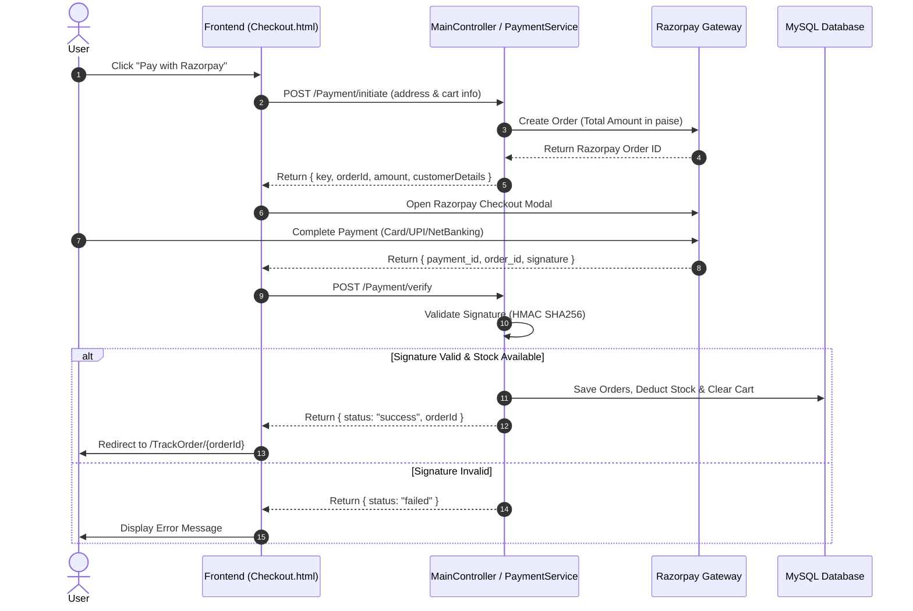

# 🛒 ViastaStore - Full-Stack E-Commerce Platform

[](https://www.oracle.com/java/)
[](https://spring.io/projects/spring-boot)
[](https://www.mysql.com/)
[](https://www.thymeleaf.org/)
[](https://razorpay.com/)
[](LICENSE)

**ViastaStore** is a feature-rich, production-ready Full-Stack E-Commerce web application built using **Spring Boot**, **Spring Data JPA**, **MySQL**, **Thymeleaf**, and **Razorpay Payment Gateway**. It provides an end-to-end shopping experience for customers and a comprehensive administrative back-office for managing products, categories, users, orders, and customer enquiries.

---

## 🌟 Key Features

### 👤 Customer Experience (Storefront)
- **User Authentication & Security**:
  - Registration with secure password hashing and email OTP verification (5-minute expiry).
  - Resend OTP functionality and session-based role management (`User` / `Admin`).
  - Account status lifecycle (`Unverified` ➔ `Verified` ➔ `Disabled`).
- **Product Discovery & Browsing**:
  - Interactive storefront with banner carousel and responsive layout.
  - Category-based product filtering and dynamic catalog search.
  - Detailed product page with multi-image gallery, price calculation, discounts, size and color selectors.
- **Cart & Saved Addresses**:
  - Real-time shopping cart (quantity adjustments, item removals, dynamic subtotal & shipping charges).
  - Saved delivery address book with multi-address support.
- **Checkout & Payment Integration**:
  - Online payment via **Razorpay SDK** with server-side signature verification.
  - Cash on Delivery (COD) support.
  - Free shipping thresholds (orders above ₹5,000).
- **Order Tracking & Account**:
  - Live timeline-based order tracking (`Processing` ➔ `Confirmed` ➔ `Shipped` ➔ `Out For Delivery` ➔ `Delivered`).
  - Order history (`/MyOrders`) with full breakdown of items, shipping, payment status, and order timestamps.
  - User profile management.
- **Customer Support**:
  - Contact Us form & enquiry submission system with automated timestamps.

---

### 🛡️ Administrative Controls (Admin Panel)
- **Dashboard Overview**:
  - Real-time tracking of order statistics (Processing, Delivered, Cancelled).
- **Product Management**:
  - Add new products with multiple image upload support (up to 5 images saved to `/public/ProductImages`).
  - Edit product pricing, stock quantity, brand, variants (sizes, colors), and descriptions.
  - Toggle product visibility (publish / unpublish) and product status (`Available` / `Out_of_Stock`).
- **Category Management**:
  - Create, edit, and delete product categories.
  - Assign category icons and toggle public visibility.
- **Order Fulfillment**:
  - Search and filter orders by status (`Processing`, `Confirmed`, `Shipped`, `Out_For_Delivery`, `Delivered`, `Cancelled`).
  - Update order delivery status with automatic timestamps (`deliveredAt`, `cancelledAt`).
- **User Management**:
  - Manage registered users and filter by verification status (`Verified`, `Unverified`, `Disabled`).
  - Enable/disable user accounts directly from the dashboard.
- **Inquiries & Feedback**:
  - Centralized customer enquiry and feedback inbox.

---

## 🏗️ Tech Stack

| Layer | Technology |
|---|---|
| **Backend Framework** | Spring Boot 4.x (Java 24) |
| **Persistence / ORM** | Spring Data JPA / Hibernate |
| **Database** | MySQL 8.0+ |
| **Template Engine** | Thymeleaf & HTML5 / CSS3 / JavaScript |
| **Payment Gateway** | Razorpay Java SDK (`1.4.9`) |
| **Mailing Service** | Spring Boot Starter Mail (JavaMailSender / Gmail SMTP TLS) |
| **File Handling** | Multipart File Upload (`Spring Servlet Multipart`) |
| **Build Tool** | Apache Maven |

---

## 📂 Project Architecture & Directory Structure

```text
Viastastore/
├── public/
│   └── ProductImages/                  # Uploaded product images
├── src/
│   ├── main/
│   │   ├── java/com/project/Viastastore/
│   │   │   ├── Controller/
│   │   │   │   ├── AdminController.java    # Admin dashboard, products, users & orders
│   │   │   │   └── MainController.java     # Storefront, cart, auth, checkout & tracking
│   │   │   ├── Dto/                        # Data Transfer Objects
│   │   │   │   ├── CategoryDto.java
│   │   │   │   ├── EnquiryDto.java
│   │   │   │   ├── OrderDto.java
│   │   │   │   ├── ProductDto.java
│   │   │   │   ├── SavedAddressDto.java
│   │   │   │   └── UserDto.java
│   │   │   ├── MailService/
│   │   │   │   ├── PaymentService.java     # Razorpay order creation & signature verification
│   │   │   │   └── SendMailService.java    # SMTP OTP mail sender
│   │   │   ├── Model/                      # JPA Entities
│   │   │   │   ├── Cart.java
│   │   │   │   ├── Category.java
│   │   │   │   ├── Enquiry.java
│   │   │   │   ├── Orders.java
│   │   │   │   ├── Products.java
│   │   │   │   ├── SavedAddress.java
│   │   │   │   └── Users.java
│   │   │   ├── Repository/                 # Spring Data JPA Repositories
│   │   │   │   ├── CartRepo.java
│   │   │   │   ├── CategoryRepo.java
│   │   │   │   ├── EnquiryRepo.java
│   │   │   │   ├── OrderRepo.java
│   │   │   │   ├── ProductRepo.java
│   │   │   │   ├── SavedAddressRepo.java
│   │   │   │   └── UserRepo.java
│   │   │   └── ViastastoreApplication.java # Spring Boot Entry Point
│   │   └── resources/
│   │       ├── application.properties      # Database, mail & file upload configs
│   │       ├── static/                     # CSS, JS, vendor libraries, icons & images
│   │       └── templates/                  # Thymeleaf HTML Templates
│   │           ├── Admin/                  # Admin portal views
│   │           │   ├── AddCategory.html
│   │           │   ├── AddProduct.html
│   │           │   ├── Adminbase.html
│   │           │   ├── Dashboard.html
│   │           │   ├── EditCategory.html
│   │           │   ├── EditProduct.html
│   │           │   ├── Feedbacks.html
│   │           │   ├── ManageOrders.html
│   │           │   ├── ManageProduct.html
│   │           │   ├── ManageUsers.html
│   │           │   ├── UpdateOrder.html
│   │           │   └── ViewEnquiry.html
│   │           ├── Checkout.html
│   │           ├── ContactUs.html
│   │           ├── MyOrders.html
│   │           ├── MyProfile.html
│   │           ├── Product.html
│   │           ├── SavedAddress.html
│   │           ├── TrackOrder.html
│   │           ├── base.html
│   │           ├── cart.html
│   │           ├── index.html
│   │           ├── login.html
│   │           ├── register.html
│   │           ├── shop.html
│   │           └── verify-otp.html
│   └── test/                               # Unit & Integration Tests
├── pom.xml                                 # Maven dependencies and build configuration
└── README.md                               # Project documentation
```

---

## 🗄️ Database Entities & Relationships

- **`Users`**: Stores credentials, contact info, role (`User`, `Admin`), status (`Unverified`, `Verified`, `Disabled`), and OTP metadata.
- **`Category`**: Product classifications with visibility toggles.
- **`Products`**: Product catalog with SKU details, pricing, discount, variants (sizes, colors), stock, and images.
- **`Cart`**: Junction entity linking users and products with selected quantity, size, color, and price.
- **`SavedAddress`**: Address book linked to users for streamlined checkout.
- **`Orders`**: Individual order items containing snapshots of product details, pricing, shipping address, order status, and Razorpay payment identifiers.
- **`Enquiry`**: Customer support tickets and contact form submissions.

---

## ⚙️ Prerequisites & Setup

### Requirements
- **Java**: JDK 21+ (Java 24 supported)
- **Database**: MySQL Server 8.0+
- **Build Tool**: Maven 3.8+ (or use the included `./mvnw` wrapper)
- **SMTP Server**: Gmail App Password (or custom SMTP server)
- **Payment Gateway**: Razorpay Test/Live API Key ID and Secret

---

## 🚀 Quick Start Guide

### 1. Clone the Repository
```bash
git clone https://github.com/princegupt1234/Vistastore.git
cd Vistastore
```

### 2. Configure MySQL Database
Create a database in your local MySQL instance:
```sql
CREATE DATABASE viastastore_db;
```

### 3. Update Application Properties
Edit [`src/main/resources/application.properties`](file:///c:/Users/princ/Desktop/SpringBoot/Viastastore/src/main/resources/application.properties) with your database, mail, and port credentials:

```properties
spring.application.name=Viastastore

# Database Configuration
spring.datasource.driver-class-name=com.mysql.cj.jdbc.Driver
spring.datasource.url=jdbc:mysql://localhost:3306/viastastore_db
spring.datasource.username=YOUR_MYSQL_USERNAME
spring.datasource.password=YOUR_MYSQL_PASSWORD
spring.jpa.hibernate.ddl-auto=update
spring.jpa.show-sql=true

# Email Configuration (SMTP)
spring.mail.host=smtp.gmail.com
spring.mail.port=587
spring.mail.username=YOUR_GMAIL_ADDRESS
spring.mail.password=YOUR_GMAIL_APP_PASSWORD
spring.mail.properties.mail.smtp.auth=true
spring.mail.properties.mail.smtp.starttls.enabled=true
spring.mail.properties.mail.smtp.starttls.required=true

# File Upload Configuration
spring.servlet.multipart.enabled=true
spring.servlet.multipart.max-file-size=25MB
spring.servlet.multipart.max-request-size=25MB
```

### 4. Build and Run the Application

#### Using Maven Wrapper (Windows):
```cmd
.\mvnw.cmd clean spring-boot:run
```

#### Using Maven Wrapper (Linux / macOS):
```bash
./mvnw clean spring-boot:run
```

#### Using Standard Maven:
```bash
mvn clean install
mvn spring-boot:run
```

The application will start on **`http://localhost:8080`**.

---

## 🌐 Application Endpoints

### 🛍️ Storefront (User Routes)
| Method | Endpoint | Description |
|---|---|---|
| `GET` | `/` | Home page |
| `GET` | `/shop` | Product catalog (optional category filter `?id={catId}`) |
| `GET` | `/Product/{id}` | Product details and variant selector |
| `GET` | `/register` | Customer registration |
| `POST` | `/register` | Process registration & trigger OTP email |
| `GET` | `/verify-otp` | OTP verification page |
| `POST` | `/verify-otp` | Verify OTP and activate account |
| `GET` | `/resend-otp` | Resend verification OTP |
| `GET` | `/login` | User/Admin login page |
| `POST` | `/login` | Authenticate and create session |
| `GET` | `/userLogout` | Logout current user |
| `GET` | `/cart` | View shopping cart items |
| `GET` | `/cart/add/{productId}` | Add item or increment quantity |
| `GET` | `/cart/update/{cartId}` | Update item quantity |
| `GET` | `/cart/remove/{cartId}` | Remove item from cart |
| `GET` | `/Checkout` | Checkout page with address selector |
| `POST` | `/PlaceOrder` | Place Cash on Delivery (COD) order |
| `POST` | `/Payment/initiate` | Generate Razorpay order ID via AJAX |
| `POST` | `/Payment/verify` | Verify Razorpay payment signature & confirm order |
| `GET` | `/TrackOrder/{orderId}` | Live order tracking status |
| `GET` | `/MyOrders` | User order history |
| `GET` | `/SavedAddress` | Manage delivery addresses |
| `POST` | `/SavedAddress` | Save new delivery address |
| `GET` | `/ContactUs` | Customer enquiry page |
| `POST` | `/SubmitEnquiry` | Submit customer enquiry |

### 🛠️ Admin Panel Routes
| Method | Endpoint | Description |
|---|---|---|
| `GET` | `/Admin/Dashboard` | Administrative metrics dashboard |
| `GET` | `/Admin/ManageUsers` | List and filter users |
| `GET` | `/Admin/UpdateUserStatus/{id}` | Enable/Disable user accounts |
| `GET` | `/Admin/AddCategory` | Create product category |
| `POST` | `/Admin/AddCategory` | Save new category |
| `GET` | `/Admin/EditCategory/{id}` | Edit category details |
| `POST` | `/Admin/EditCategory/{id}` | Update category |
| `GET` | `/Admin/DeleteCategory/{id}` | Delete category |
| `GET` | `/Admin/ToggleCategoryVisibility/{id}`| Toggle category public visibility |
| `GET` | `/Admin/AddProduct` | Add product with image upload |
| `POST` | `/Admin/AddProduct` | Process product creation |
| `GET` | `/Admin/ManageProduct` | List all products |
| `GET` | `/Admin/EditProduct/{id}` | Edit product details and images |
| `POST` | `/Admin/EditProduct/{id}` | Update product information |
| `GET` | `/Admin/DeleteProduct/{id}` | Delete product |
| `GET` | `/Admin/ToggleProductVisibility/{id}` | Toggle product visibility |
| `GET` | `/Admin/ManageOrders` | View and filter customer orders |
| `GET` | `/Admin/UpdateOrder/{id}` | Update order status |
| `POST` | `/Admin/UpdateOrderStatus/{id}` | Save updated status (Delivered, Shipped, etc.) |
| `GET` | `/Admin/ViewEnquiry` | View customer inquiries |
| `GET` | `/Admin/logout` | Logout admin session |

---

## 💳 Payment Flow Architecture (Razorpay)



---

## 🤝 Contributing

Contributions, issues, and feature requests are welcome!
1. Fork the Project
2. Create your Feature Branch (`git checkout -b feature/AmazingFeature`)
3. Commit your Changes (`git commit -m 'Add some AmazingFeature'`)
4. Push to the Branch (`git push origin feature/AmazingFeature`)
5. Open a Pull Request

---

## 📄 License

This project is licensed under the [MIT License](LICENSE).
